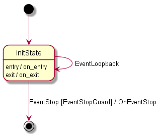
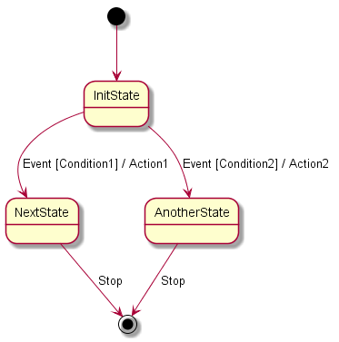
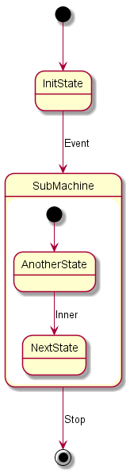
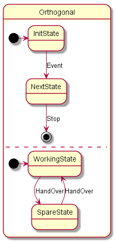

# Boost MSM Basic
MSM stand for Meta State Machine

---

# Basic Idea
- 使用GMock GTest框架，通过UT方式展现Boost MSM的功能
- 案例主要基于此状态机：


---

# Functor

- 重载了（）operator的Class或struct
- Fuctor主要用于代替C语言中的回调函数
    - 更易于从用
    - 每个Functor实例可以有自己的状态
    - 更易于编译器优化代码可执行速度（可将Functor优化成inline函数）
- Boost::MSM 推荐使用Functor用于定义Guard和Action
```C++
class ShorterThan {
    public:
        explicit ShorterThan(int maxLength) : length(maxLength) {}
        bool operator() (const string& str) const {
            return str.length() < length;
        }
    private:
        const int length;
};
ShorterThan shorterThan5{5}, shorterThan9{9};
```
---

# 状态机
- A state machine is a concrete model describing the behavior of a system. It is composed of a finite number of states and transitions.
- Boost MSM状态机的实现主要基于UML的状态机的定义
    包含： State, Event, Transition, Action, Guard
- Boost MSM official link
    https://www.boost.org/doc/libs/1_73_0/libs/msm/doc/HTML/index.html
- 代码约定
    ```C++
    #include <boost/msm/front/state_machine_def.hpp> // boost MSM header file
    namespace msm = boost::msm; // 使用msm命名空间，简化代码
    ```

---

# Boost MSM 定义状态机
```C++
struct StateMachine_ : public msm::front::state_machine_def<StateMachine_>
{
    // Entry action For StateMachine
    template <class Event, class Fsm>
    void on_entry(Event const&, Fsm&) const
    {}
    // Exit action
    template <class Event, class Fsm>
    void on_exit(Event const&, Fsm&) const
    {}
    // Set initial state
    typedef State::InitState initial_state;
    // Transition table
    struct transition_table
        : public boost::mpl::vector<
              // |Start            |Event       |Next
              Row<State::InitState, Event::Stop, State::EndState>
    {};
};
// Pick a back-end
typedef msm::back::state_machine<StateMachine_> StateMachine;
```

---

# 状态
- 用于描述系统在某一特定时间内的状态
- 一个状态可以包含以个部分：
    - 状态名 - E状态名称 
    - Entry Action - 进入状态时执行的动作
    - Exit Action - 离开状态下时执行的操作
    - Defer Event - 在该状态下未处理的事件列表，而是被推迟并排队等待另一个状态的对象处理


---

# Boost MSM 定义状态
- Must be derived from boost::msm::front::state<>
```C++
struct InitState : public msm::front::state<>
{
    // Entry action
    template <class Event, class Fsm>
    void on_entry(Event const &, Fsm &) const
    {
    }
    // Exit action
    template <class Event, class Fsm>
    void on_exit(Event const &, Fsm &) const
    {
    }
};
```

---

# 消息（事件）
- 在某一特定时间，发生可对系统产生影响的事件
- 消息可以有参数
- 消息被系统接收后，消息被消耗（consume）
- 比如对于键盘来说，用户每按下一个键，键盘就接收到一个消息，按键值为该消息的参数。当键盘接收消息后，用户需从新按键，才能再次触发按键消息。

---

# Boost MSM 定义消息
- Simple structure, no special base class is required
```C++
struct KeyPressed {
    KeyPressed(int key) : key{key} {}; // Constructor isn't mandatory
    int key;
};

struct PowerOff {}; // Empty Structure is Okay
```

---

# Transition, Guard, Action
- 系统在接收到消息后，从当前状态转变到另一个状态。（源状态和目标状态可为同一状态）
- Transition发生前，系统调用Guard，用于决定是否发生状态转移。
    - 比如汽车发动前，检查刹车状态
- Guard检查通过后，系统退出当前状态，调用当前状态的exit方法。
    - 退出驻车状态，如果双跳灯开启的话，关闭双跳灯
- 系统调用Action方法用以响应收到的消息。
    - 启动发动机，响应启动消息
- 系统完成消息响应的Action后，进入目标状态，调用目标状态的entry方法。
    - 进入行车状态，打开行车灯

---

# Boost MSM Transition Table
- Boost MSM使用Transition Table描述Transition
```C++
using msm::front::Row;

// Transition table
struct transition_table : public boost::mpl::vector<
    // |Start State      |Event        |Next State       |Action              |Guard
    Row<State::InitState, Event::Event, State::NextState>
    Row<State::NextState, Event::Stop,  State::EndState, Action::OnEventStop, Guard::EventStopGuard>

    // Row的参数个数可以是3，即Action和Guard为none如：
    // Row<State::InitState, Event::Event, State::NextState>
    // Row的参数个数也可以是4，即Guard为none
    // Row<State::InitState, Event::Stop, State::EndState, Action::OnEventStop>
>{};
```
- 通过transition table，可以确定State的Id（即current_state()返回的值），其确定的方法是:先从Start State这一列开始由上往下（由0开始）为每一个State标index（InitState为0， NextState为1），当遍历完Start State后。同样规则遍历Next State这一列（EndState为2）

---

# Boost MSM Guard
```C++
struct GeneralGuard
{
    // Operator() with four parameters
    template <class Event, class Fsm, class SourceState, class TargetState>
    bool operator()(Event const &e, Fsm &, SourceState &, TargetState &)
    {
    }
    // 根据C++ Template的特性，也可以定义（）operator的specialized版本
    template <class Fsm, class SourceState, class TargetState>
    bool operator()(Event::Stop const &e, Fsm &, SourceState &, TargetState &)
    {
        return e.readyToStop;
    }
};
```

---

# Boost MSM Action
```C++
struct Action
{
    // Parameter is same as Guard, but without return value
    template <class Event, class Fsm, class SourceState, class TargetState>
    void operator()(Event const &, Fsm &fsm, SourceState &, TargetState &) const
    {
    }
};
```

---

# Boost MSM StateMachine

```C++
struct StateMachine_ : public msm::front::state_machine_def<StateMachine_>
{
    // 当调用状态机对象的start()函数启动状态机时被调用
    template <class Event, class Fsm>
    void on_entry(Event const&, Fsm&) const
    {}
    // 当调用状态机对象的stop()函数停止状态机时被调用
    template <class Event, class Fsm>
    void on_exit(Event const&, Fsm&) const
    {}
    // Set initial state
    typedef State::InitState initial_state;
    // Transition table
    struct transition_table : public boost::mpl::vector<
        Row  <State::InitState, Event::Stop,     State::EndState,   Action::OnEventStop>
    >{};
};
// Pick a back-end 目前MSM的backend只有一种
typedef msm::back::state_machine<StateMachine_> StateMachine;
``` 

---

# Boost MSM 基本操作

```C++
typedef msm::back::state_machine<StateMachine_> StateMachine;
StateMachine machine;

machine.start(); // 启动状态机。 还有一重载版本start(event);
machine.process_event(KeyPressed{60});
machine.current_state(); // 得到当前状态值，注返回值为int*类型，为一组当前所处的类型（有子状态）。
                         // 状态值有Transition Table中State由上至下的顺序决定其值。
machine.stop(); // 停止状态机。 还有一重载版本stop(event)
```

---

# Conflict Transition
- 当响应同一消息时，根据不同条件进行不同处理
```C++
// Transition table
struct transition_table : public boost::mpl::vector<
    Row<InitState, Event, NextState,    Action1, Condition1>,
    Row<InitState, Event, AnotherState, Action2, Condition2>
>{};
```
注意：Boost MSM匹配transition的顺序是由下向上的。上例的匹配顺序为：
- 先运行Condition2，如满足，运行Action2，状态迁移到AnotherState
- 如Condition2验证失败，运行Condition1，如满足，运行Action1，状态迁移到NextState
- 如Condition1验证失败，则不发生状态迁移

---

# Anonymous Transitions
- 在没有事件触发的情况下，当一个State完成后自动迁移到下一状态。
    - 状态机启动后进入初始状态
    - 等于UML中的状态图降级为活动图
    - 可以通过设置Guard，实现条件判断
- 在上例中将触发消息用boost::msm::front::none替代，就将普通State Transit转化为Anonymous Transit
```C++
struct transition_table : public boost::mpl::vector<
    Row<InitState, msm::front::none, NextState,     Action1, Condition1>, 
    Row<InitState, msm::front::none, AnotherState,  Action2, Condition2>
>{};
```
- 上述Transit Table中的Action和Guard也可删除或为none。则状态自动迁移，匹配规则同样自下而上。

---


# Submachine
```C++
struct StateMachine_ : public msm::front::state_machine_def<StateMachine_>
{
    // Define SubMachine
    struct SubMachine_ : public msm::front::state_machine_def<SubMachine_>
    {
        typedef State::AnotherState initial_state;
        struct transition_table : public boost::mpl::vector<
            Row<State::AnotherState, Event::Inner, State::NextState>,
            Row<State::NextState,    Event::Stop,  State::EndState>
        >{};
    };
    typedef msm::back::state_machine<SubMachine_> SubMachine;
    typedef State::InitState initial_state;
    struct transition_table : public boost::mpl::vector<
        Row<State::InitState, Event::Event, SubMachine>
    >{};
};
typedef msm::back::state_machine<StateMachine_> StateMachine;
```
Submachine直接定义在State Machine内，Boost MSM会自动将消息派送到Submachine内。
```C++
StateMachine sut;
sut.start();
sut.process_event(Event::Event{}); sut.process_event(Event::Inner{});
```

---


# Orthogonal Region

- 有时我们需要定义在一个状态机里面定义两个正交的子状态机。比如一个子状态机专门用于处理业务，而另一个状态机专门维护当前的状态。
```C++
struct StateMachine_ : public msm::front::state_machine_def<StateMachine_>
{
    // Set initial state and define two Orthogonal region
    typedef boost::mpl::vector<State::InitState, State::WorkingState> initial_state;
    // Transition table
    struct transition_table : public boost::mpl::vector<
        //|Start                |Event           |Next
        Row<State::InitState,    Event::Event,    State::NextState>,
        Row<State::NextState,    Event::Stop,     State::EndState>,
        Row<State::WorkingState, Event::HandOver, State::SpareState>,
        Row<State::SpareState,   Event::HandOver, State::WorkingState>
    >{};
};
```
- 注意两个子状态不要有公共的消息，不然位于前面的Transition会被后面的Transition掩盖掉。
- 定义有几个Region，由typedef boost::mpl::vector<...> initial_state;模板中的初始状态个数决定

---

# Defer Event
```C++
struct StateMachine_ : public msm::front::state_machine_def<StateMachine_>
{
    // Make the Current StateMachine support Defer Message
    typedef int activate_deferred_events;
    typedef State::InitState initial_state;
    // Transition table
    struct transition_table : public boost::mpl::vector<
        //|Start             |Event        |Next             |Action            |Guard
        Row<State::InitState, Event::Event, State::NextState, Action::Action1,   Guard::Condition1>,
        Row<State::InitState, Event::Stop,  msm::front::none, msm::front::Defer, Guard::Condition1>, 
        Row<State::NextState, Event::Stop,  State::EndState,  Action::Action2,   Guard::Condition2>
    >{};
};
// Pick a back-end
typedef msm::back::state_machine<StateMachine_> StateMachine;

StateMachine sut{};
sut.start();
sut.process_event(Event::Stop{}); // Event is deferred at first
sut.process_event(Event::Event{}); 
```
通过Guard可以决定，是否在当前状态下保存收到的Event
