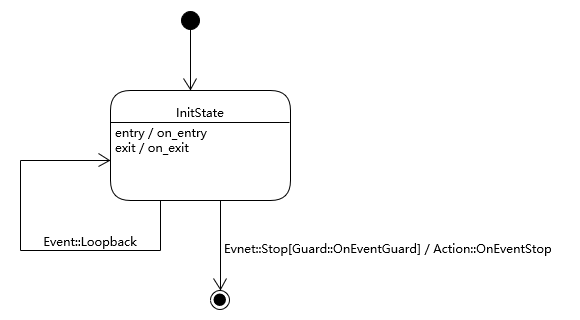

# Boost MSM Basic
MSM stand for Meta State Machine

---

# Basic Idea
- 使用GMock GTest框架，通过UT方式展现Boost MSM的功能
- 案例主要基于此状态机：


---

# 状态机
- A state machine is a concrete model describing the behavior of a system. It is composed of a finite number of states and transitions.
- Boost MSM状态机的实现主要基于UML的状态机的定义
    包含： State, Event, Transition, Action, Guard
- Boost MSM official link
    https://www.boost.org/doc/libs/1_73_0/libs/msm/doc/HTML/index.html
- 代码约定
    ```C++
    #include <boost/msm/front/state_machine_def.hpp> // boost MSM header file
    namespace msm = boost::msm; // 使用msm命名空间，简化代码
    ```

---

# Boost MSM 定义状态机
```C++
struct StateMachine_ : public msm::front::state_machine_def<StateMachine_>
{
    // Entry action For StateMachine
    template <class Event, class Fsm>
    void on_entry(Event const&, Fsm&) const
    {}
    // Exit action
    template <class Event, class Fsm>
    void on_exit(Event const&, Fsm&) const
    {}
    // Set initial state
    typedef State::InitState initial_state;
    // Transition table
    struct transition_table
        : public boost::mpl::vector<
              // |Start            |Event       |Next
              Row<State::InitState, Event::Stop, State::EndState>
    {};
};
// Pick a back-end
typedef msm::back::state_machine<StateMachine_> StateMachine;
```

---

# 状态
- 用于描述系统在某一特定时间内的状态
- 一个状态可以包含以个部分：
    - 状态名 - E状态名称 
    - Entry Action - 进入状态时执行的动作
    - Exit Action - 离开状态下时执行的操作
    - Defer Event - 在该状态下未处理的事件列表，而是被推迟并排队等待另一个状态的对象处理


---

# Boost MSM 定义状态
- Must be derived from boost::msm::front::state<>
```C++
struct InitState : public msm::front::state<>
{
    // Entry action
    template <class Event, class Fsm>
    void on_entry(Event const &, Fsm &) const
    {
    }
    // Exit action
    template <class Event, class Fsm>
    void on_exit(Event const &, Fsm &) const
    {
    }
};
```

---

# 消息（事件）
- 在某一特定时间，发生可对系统产生影响的事件
- 消息可以有参数
- 消息被系统接收后，消息被消耗（consume）
- 比如对于键盘来说，用户每按下一个键，键盘就接收到一个消息，按键值为该消息的参数。当键盘接收消息后，用户需从新按键，才能再次触发按键消息。

---

# Boost MSM 定义消息
- Simple structure, no special base class is required
```C++
struct KeyPressed {
    KeyPressed(int key) : key{key} {}; // Constructor isn't mandatory
    int key;
};

struct PowerOff {}; // Empty Structure is Okay
```

---

# Transition, Guard, Action
- 系统在接收到消息后，从当前状态转变到另一个状态。（源状态和目标状态可为同一状态）
- Transition发生前，系统调用Guard，用于决定是否发生状态转移。
    - 比如汽车发动前，检查刹车状态
- Guard检查通过后，系统退出当前状态，调用当前状态的exit方法。
    - 退出驻车状态，如果双跳灯开启的话，关闭双跳灯
- 系统调用Action方法用以响应收到的消息。
    - 启动发动机，响应启动消息
- 系统完成消息响应的Action后，进入目标状态，调用目标状态的entry方法。
    - 进入行车状态，打开行车灯

---

# Boost MSM Transition Table
- Boost MSM使用Transition Table描述Transition
```C++
using msm::front::Row;

// Transition table
struct transition_table : public boost::mpl::vector<
    // |Start State      |Event       |Next State      |Action              |Guard
    Row<State::InitState, Event::Stop, State::EndState, Action::OnEventStop, Guard::EventStopGuard>
    // Row的参数个数可以是3，即Action和Guard为none如：
    // Row<State::InitState, Event::Stop, State::EndState>
    // Row的参数个数也可以是4，即Guard为none
    // Row<State::InitState, Event::Stop, State::EndState, Action::OnEventStop>
>{};
```